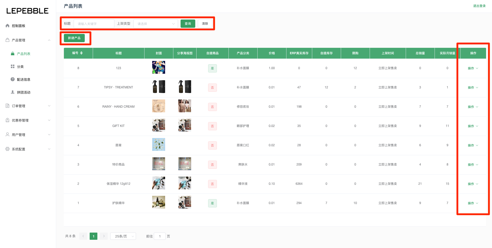
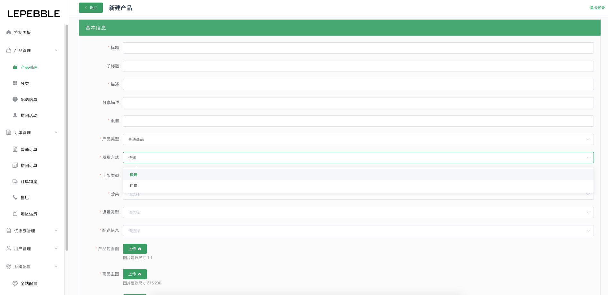
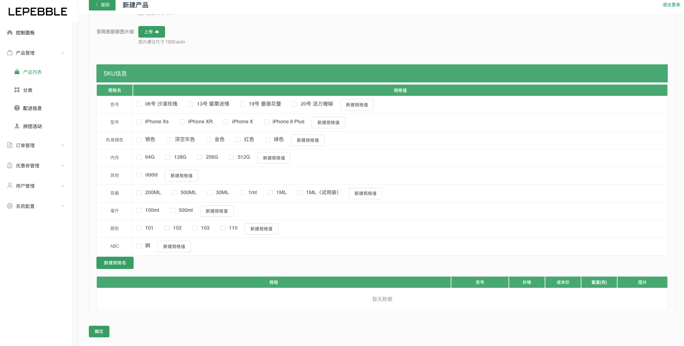
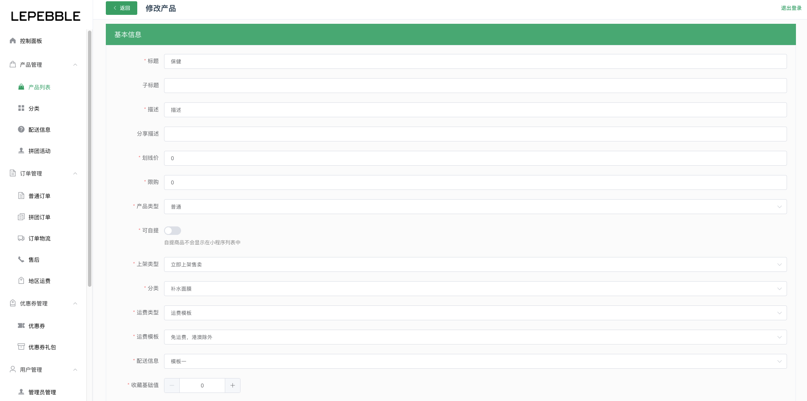
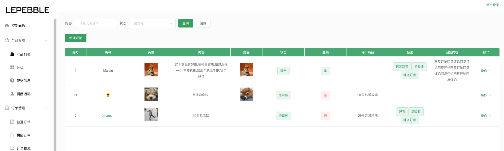

# 4.1 产品列表

## 产品列表

在产品列表页面下可以查看系统内所有商品的信息

* 搜索：通过产品列表的搜索栏搜索产品标题和上架类型
* 操作：通过商品右边的操作按钮，查看产品详情、编辑商品、管理评论
* 新建产品：通过新建产品按钮创建产品

## 新建产品

在新建产品页面可以创建产品，录入SkuCode等信息。红色星号为必填字段

### 字段说明：

#### 基本信息

* 标题（必填）：产品的名字
* 子标题：产品的副标题
* 描述（必填）：产品的描述
* 分享描述：用于分享小程序卡片
* 限购（必填）：用于限制用户购买商品的最大数
* 产品类型（必选）：普通，选择产品的类型
* 发货方式（必选）：快递或者自提
* 上架类型（必选）：立即上架售卖、自定义上架时间、暂不售卖，放入仓库
* 分类（必选）：选择商品的分类，分类在 **分类模块** 里面进行管理。
* 运费类型（必选）：固定运费、运费模版
* 配送信息（必选）：选择配送信息模版
* 产品封面图（必传）：图片建议尺寸 1:1
* 商品主图（必传）：图片建议尺寸 375:230
* 商品详情图（必传）：图片建议尺寸 375:auto
* 官网顶部视频：图片建议尺寸 1920:auto
* 官网轮播图片（必传）：图片建议尺寸 1:1
* 官网底部部图片组：图片建议尺寸 1920:auto

#### SKU信息

规格名：规格的名字。可以新建规格名，也可以从已有的规格名中选择。

规格值：规则的数值。可以新建规格值，也可以从已有的规则值中选择。

一个规格名可以有多个规格值。

## 产品详情

查看产品的详情，可以通过底部的编辑按钮直接进入编辑产品页面；也可以通过底部的评论按钮直接进入产品的评论模块。

## 编辑产品

在编辑产品页面可以对已经创建好的产品进行编辑操作，操作内容与新建产品相似。

## 评论管理

可以对产品的评论进行管理，可以对产品新建评论；查看用户对产品的评论、查看详情、编辑、删除、置顶、隐藏、修改回复和打标签。

