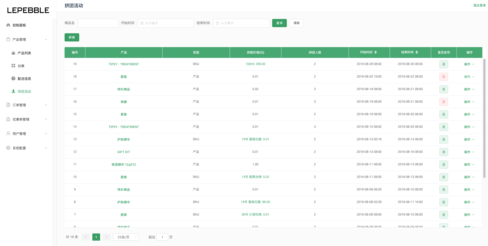
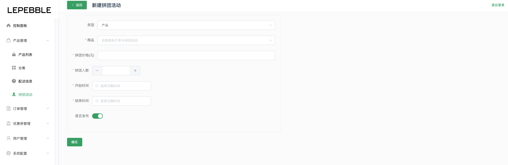

# 4.4 拼团活动

拼团活动的管理模块

## 拼团列表

在拼团列表页面下可以查看系统内所有的拼团活动信息

* 搜索：根据商品名、开始时间、结束时间搜索相关的拼团活动信息
* 新建：新建拼团活动
* 操作：查看拼团活动、编辑拼团活动、对拼团活动进行发布或取消发布操作

## 新建拼团活动

通过新建拼团活动页面，发布拼团活动。

#### 字段说明：

* 类型：选择拼团产品的类型，产品或者SKU。
* 商品（必选）：选择参加拼团活动的产品，该数据从产品列表获取。
* 拼团价格（必填）：规定拼团的价格
* 拼团人数（必填）：规定成团的人数
* 开始时间（必填）：选择拼团的开始时间
* 结束时间（必填）：选择拼团的结束时间
* 是否发布：勾选后可以立即发布拼团，否则可以手动发布。

