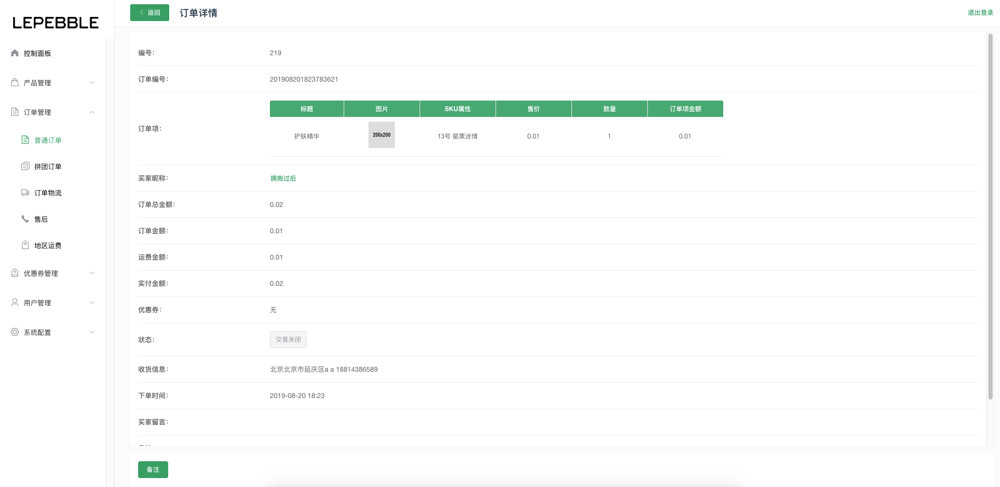

# 5.1 普通订单

## 普通订单列表

在普通订单列表页面下可以查看通过小程序下单的所有普通订单

* 搜索：可以通过搜索订单的编号、快递单号、昵称、收货人姓名、收货人电话、订单状态、下单开始时间、下单结束时间来查询订单。
* 导出数据：可以通过 **导出数据** 按钮导出订单数据，订单数据导出后，会发送到管理员邮箱。
* 操作：可以通过订单右边的操作按钮，查看订单的详情、添加备注信息。

## 申请退款订单审核

用户发起的申请退款订单，可以通过顶部的搜索栏把申请退款的订单筛选出来，再进入订单的详情页面进行退款操作。

