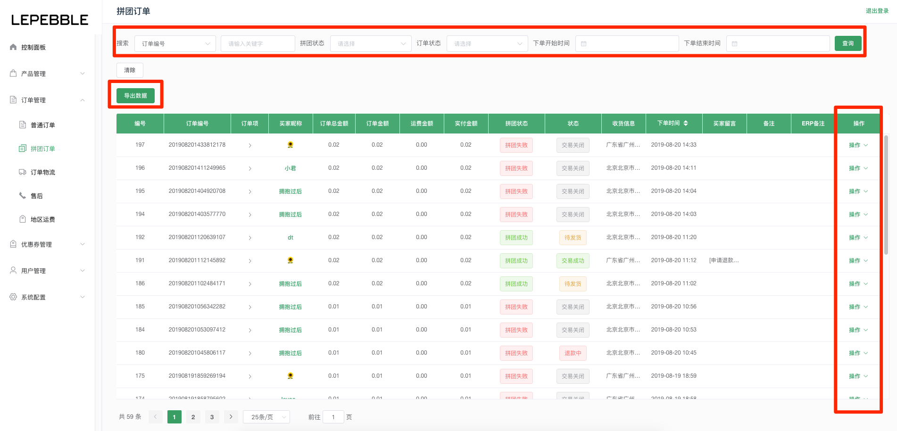
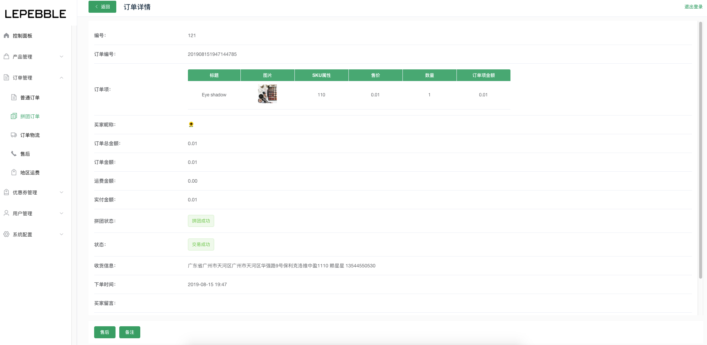
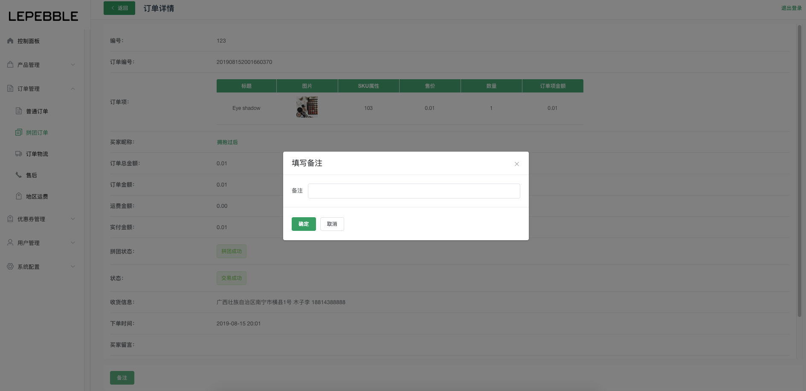

# 5.2 拼团订单

## 拼团订单列表

在拼团订单列表页面下可以查看通过小程序下单的所有拼团订单

* 搜索：可以通过搜索订单的编号、快递单号、昵称、收货人姓名、收货人电话、拼团状态、订单状态、下单开始时间、下单结束时间来查询订单。
* 导出数据：可以通过 **导出数据** 按钮导出订单数据，订单数据导出后，会发送到管理员邮箱。
* 操作：可以通过订单右边的操作按钮，查看订单的详情、添加备注信息。

## 拼团订单详情

拼团订单详情页面可以查看完整的订单信息

## 备注

可以通过拼团订单详情页面底部的 **备注** 按钮，给订单添加备注信息。

