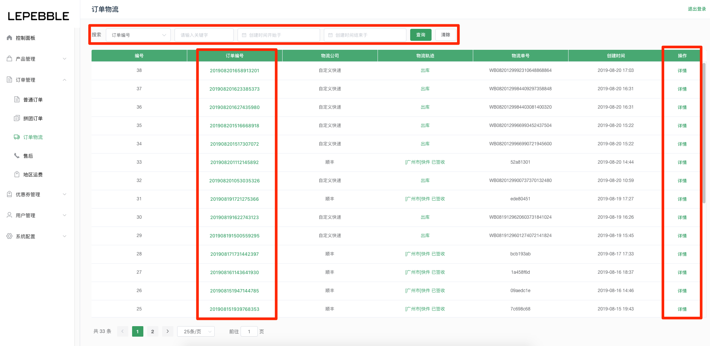
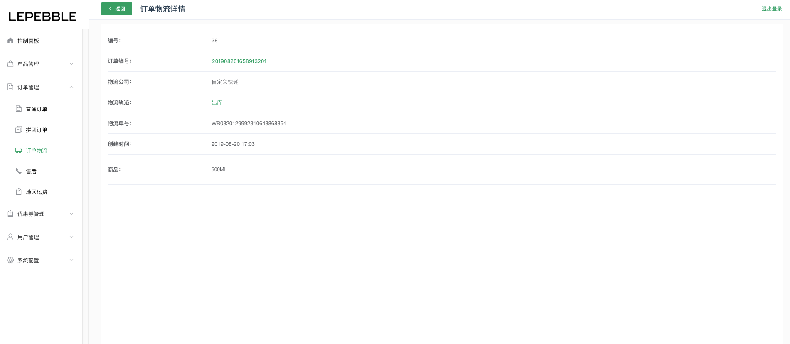

# 5.3 订单物流

## 订单物流列表

在订单物流列表页面可以查看系统下所有的订单物流信息

* 搜索：可以通过页面顶部的搜索栏，通过搜索订单编号、物流公司、物流单号、创建的开始时间、创建的结束时间搜索订单物流信息。
* 订单编号：可以通过点击订单编号，快速跳转到订单物流号相关联的订单详情页。
* 操作：可以通过列表右边的操作按钮，查看订单物流的详细信息。

## 订单物流详情

在订单物流详情页面，可以查看该订单物流的详细信息。

