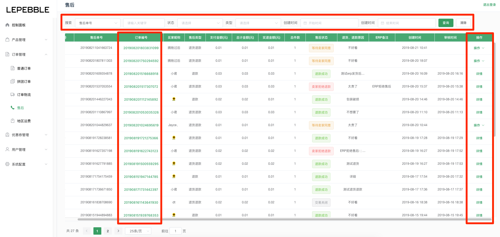

# 5.4 售后

## 售后列表

在小程序上申请售后的订单，都在会售后模块里显示。

* 搜索：可以通过售后列表顶部的搜索栏搜索售后单号、订单号、用户昵称、用户手机、用户真实姓名、售后状态、类型、售后创建开始时间、售后
* 订单编号：可以通过点击订单编号，快速跳转到售后订单相关联的订单详情页。
* 操作：可以通过列表右边的操作按钮，对售后订单进行**查看详情**、**修改退款**、**同意售后**、**拒绝售后**操作。

## 售后详情

在售后详情页面显示详细的申请售后信息和订单信息

