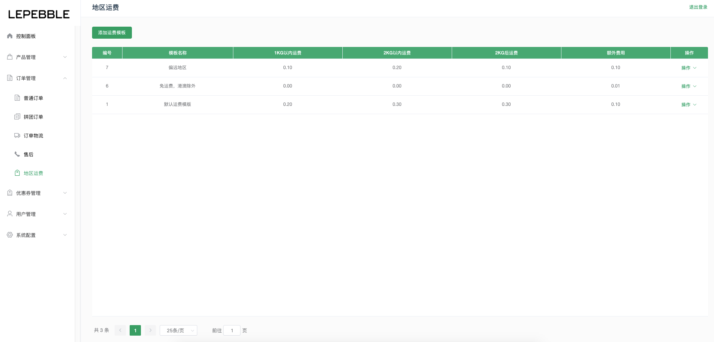
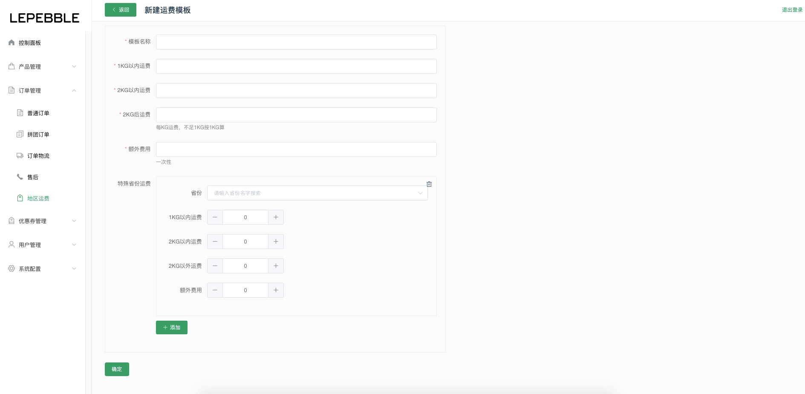
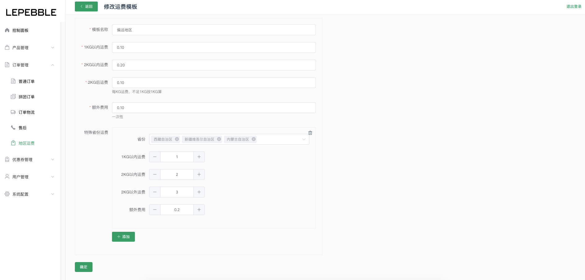

# 5.5 地区运费

地区运费管理，根据具体的运营状态和不同的地区，调整运费。

## 地区运费列表

## 新建运费模版

字段说明：

* 模版名称（必填）：运费模版的名称
* 1KG以内运费（必填）：订单重量在1KG以内的运费
* 2KG以内运费（必填）：订单重量在2KG以内的运费
* 2KG后运费（必填）：订单重量在2KG后的运费，每KG运费，不足1KG按1KG算
* 额外运费（必填）：一次性的运费
* 特殊省份运费：特殊地区的运费可能会有所不同，可以根据实际情况配置。

## 编辑运费模版

编辑已有的运费模版

