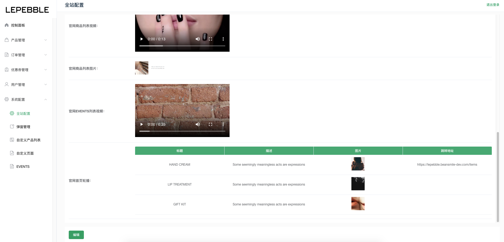

# 8.1 全站配置

全站配置页面，主要是对系统包括小程序和官网的内容进行配置。

字段说明：

* 退货收件人姓名（必填）：小程序申请退货时显示的收件人姓名
* 退货收件人号码（必填）：小程序申请退货时显示的收件人手机号码
* 退货收件人地址（必填）：小程序申请退货时显示的收件人地址
* 注册积分：会员注册时候获得的积分
* 反馈采纳积分：会员反馈被采纳时获得的积分
* 购物车顶部提示：购物车顶部的提示信息
* 搜索热词：搜索热词，多个词使用分号隔开。
* 订单申请直接退款理由（必填）：提供用户选择的退款理由，多个理由使用分号隔开。
* 申请售后理由（必填）：提供用户选择的申请售后理由，多个理由使用分号隔开。
* 注册会员页面顶图（必传）：注册会员页面的顶部图片，图片建议尺寸 343:110。
* 自提订单自提点提示：用户下单时提示
* 自提订单支付后信息通知：自提订单付款后显示的信息
* 自提活动即将结束信息通知：自提活动即将结束信息通知
* 自提活动结束日期：自提活动结束日期
* 官网欢迎页视频\(大屏\)（必传）：官网上的欢迎视频，视频推荐尺寸 1442:836。
* 官网欢迎页图片\(小屏\)（必传）：官网上的远影图片，图片建议尺寸 750:962。
* 官网商品列表视频：视频推荐尺寸 1920:auto
* 官网商品列表图片：图片建议尺寸 1920:auto
* 官网EVENTS列表视频：视频推荐尺寸 1920:auto
* 官网首页轮播：轮播图标题、描述、图片（图片建议尺寸 1440:573）和跳转地址，此处可以增加多张轮播图

