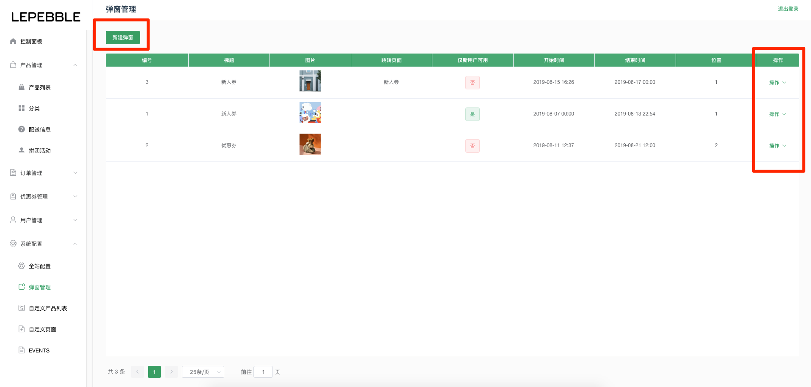
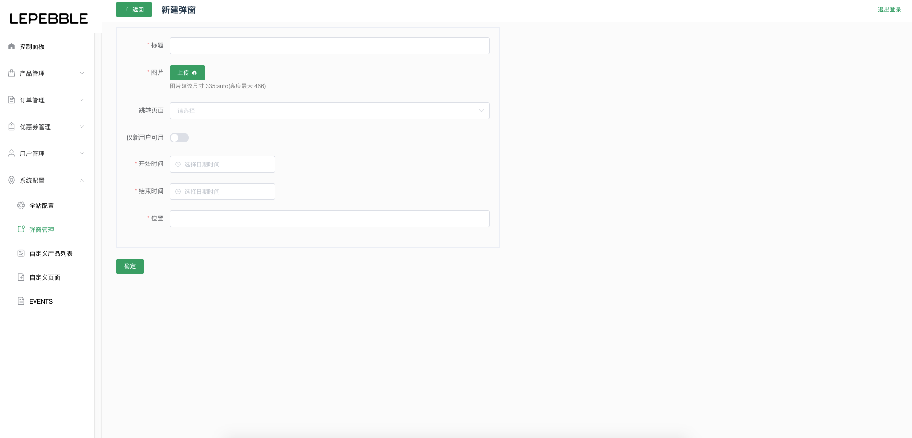
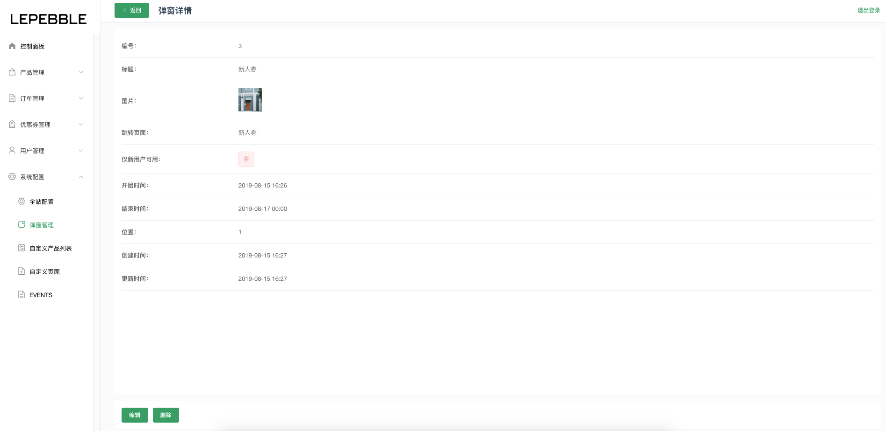
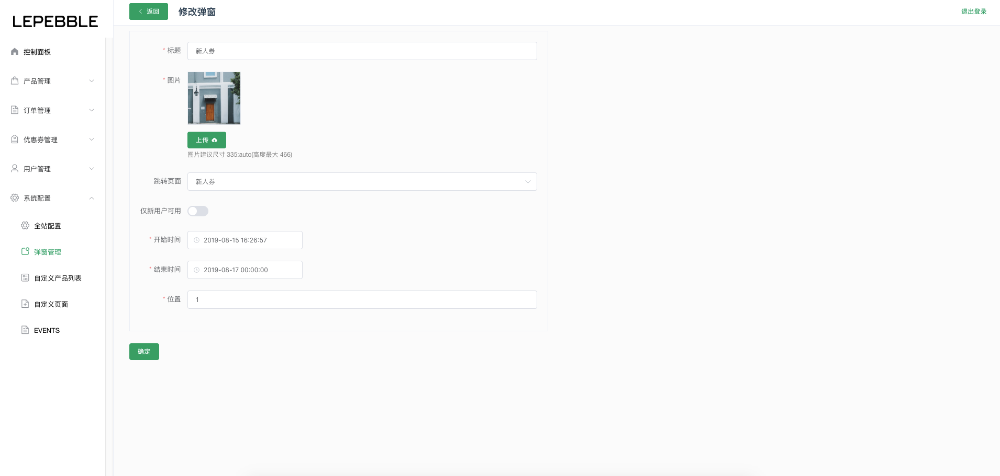

# 8.2 弹窗管理

小程序的弹窗管理模块

## 弹窗列表

小程序的弹窗管理列表

* 新建弹窗：创建新的弹窗
* 操作：通过列表右边的操作按钮，可以查看弹窗设置的详细信息、编辑弹窗和删除弹窗。

## 新建弹窗

新建弹窗页面

字段说明：

* 标题（必填）：弹窗的标题
* 图片（必传）：图片建议尺寸 335:auto\(高度最大 466\)
* 跳转页面：可以通过配置点击弹窗后跳转的页面
* 仅新用户可用：默认关闭，开启后仅新用户可看到。
* 开始时间（必填）：弹窗生效的时间
* 结束时间（必填）：弹窗失效的时间
* 位置（必填）：填写数字，按大小排序

## 弹窗详情

弹窗详情页面

## 修改弹窗

修改弹窗页面

