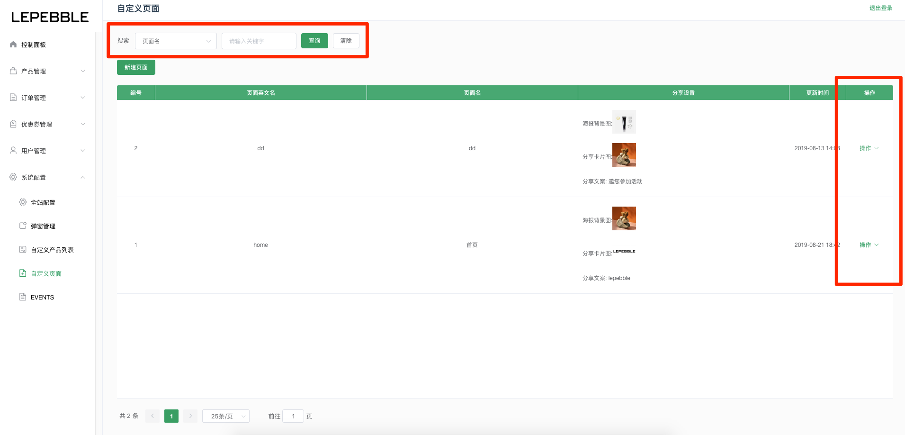
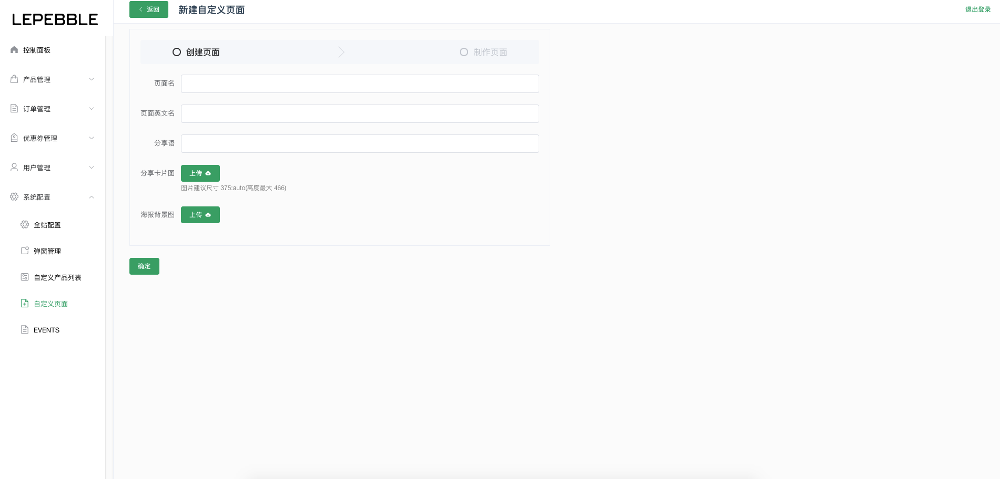
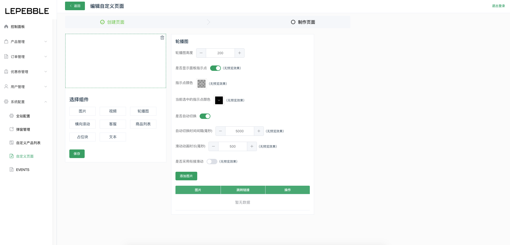

# 8.4 自定义页面

自定义页面的主要用途是配置小程序上的页面，如首页、活动页面等。

## 自定义页面列表

小程序上所有自定义页面的列表

* 搜索：可以通过列表的顶部搜索栏，搜索页面的名字。
* 操作：可以通过列表右边的操作按钮，对页面进行编辑、删除、设置分享、设置小程序页面路径。

## 新建自定义页面

新建自定义分两部。第一步是创建页面，第二步是制作页面

### 创建页面

字段说明

* 页面名：页面的名称
* 页面英文名：页面的英文名
* 分享语：显示于小程序转发时候的分享语
* 分享卡片图：图片建议尺寸 375:auto\(高度最大 466\)
* 海报背景图：分享海报的背景图片

### 制作页面

页面制作提供了一系列的组建，如：图片、视频、轮播图、横向滚动、客服、商品列表、占位块、文本。可以根据实际设计需求制作页面。

