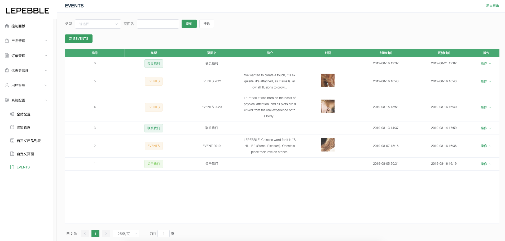
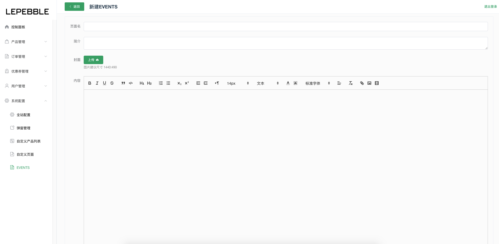
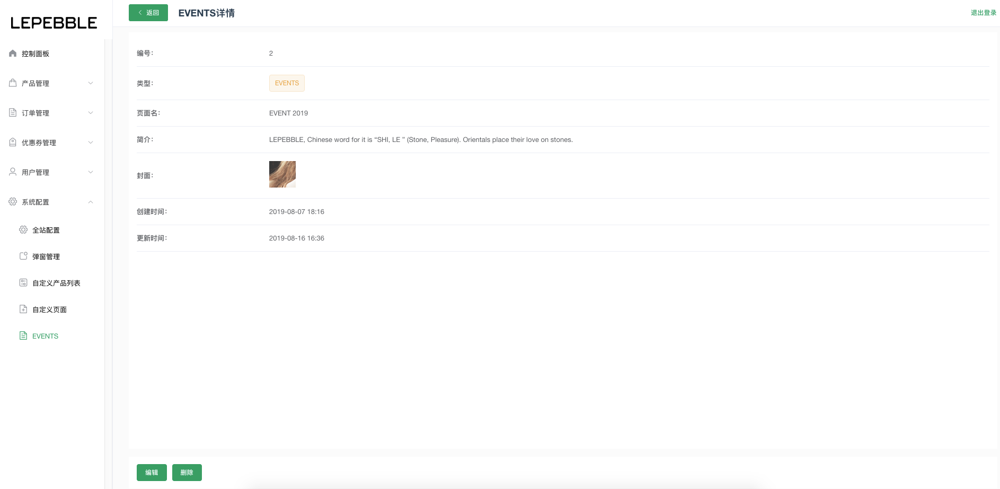
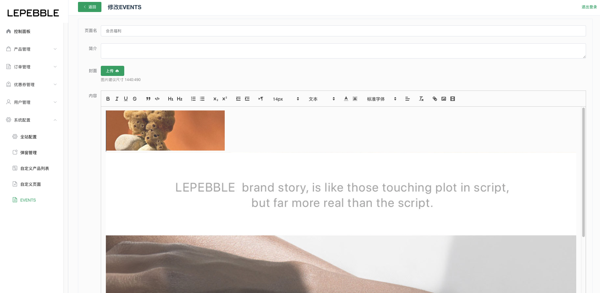

# 8.5 EVENTS

EVENTS的管理是指管理官网上的EVENTS

## EVENTS列表

EVENTS列表显示了所有的EVENTS，其中`会员福利（小程序页面）`、`联系我们（官网）`、`关于我们（官网）` 这三个EVENTS是**不可删除**的。

* 搜索：可以通过列表顶部的搜索栏，搜索类型和页面名。
* 新建EVENT：新建EVENT按钮
* 操作：可以通过列表右边的操作按钮，对已有的EVENT进行查看详情和编辑。

## 新建EVENTS

新建EVENT的页面

字段说明

* 页面名：EVENT页面的名称
* 简介：EVENT页面的简介
* 封面：图片建议尺寸 1440:490
* 内容：EVENT的内容

## EVENT详情

EVENT的详情页面

## 编辑EVENT

编辑EVENT的页面

