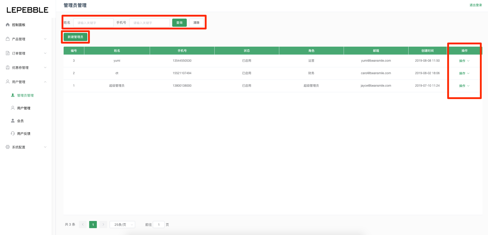
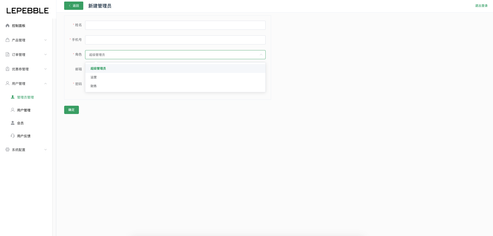
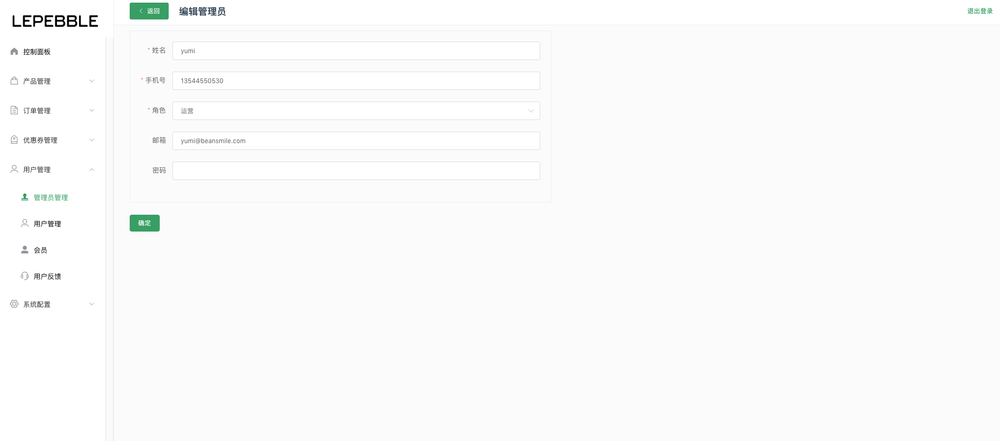
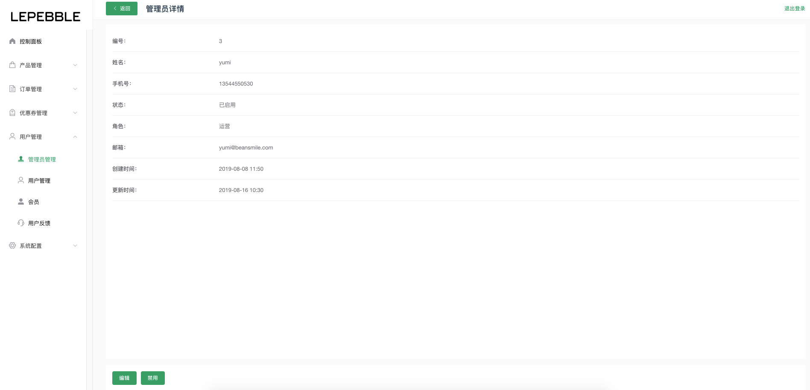

# 7.1 管理员管理

## 管理员列表

管理员管理列表的主要作用是，对系统现有的管理员进行管理。

* 搜索：通过列表顶部的搜索栏，搜索姓名、手机号码。
* 新建管理员：新增系统管理员
* 操作：通过列表右边的操作按钮，查看管理员详情、编辑管理员信息、禁用管理员。

现在系统的管理员有三种角色，分别是：

1. 超级管理员：超级管理员是系统最高权限的角色，能对所有模块进行管理。
2. 运营：运营拥有创建管理员外的所有权限
3. 财务：可以查看售后、拼团订单、普通订单和数据分析

## 新建管理员

新建管理员页面

字段说明

* 姓名（必填）：管理员的姓名
* 手机号（必填）管理员的手机号码，用于登录系统。
* 角色（必选）：选择管理员的角色
* 邮箱：管理员的邮箱
* 密码（必须）：管理员的登录密码

## 编辑管理员

编辑管理员页面

## 管理员详情

管理员详情页面

* 禁用：可以通过底部的禁用按钮，禁用该管理员。

