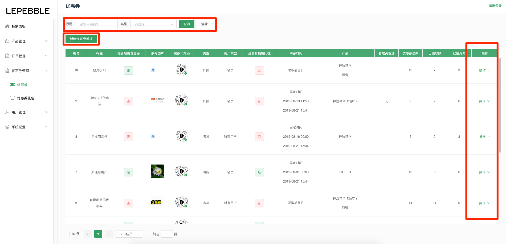
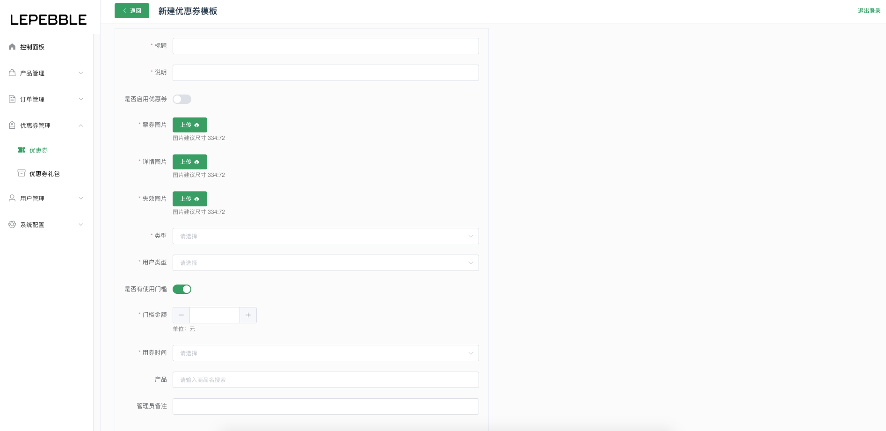
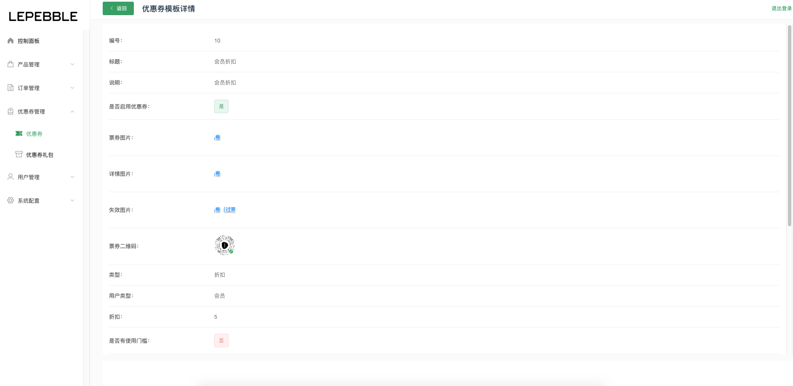
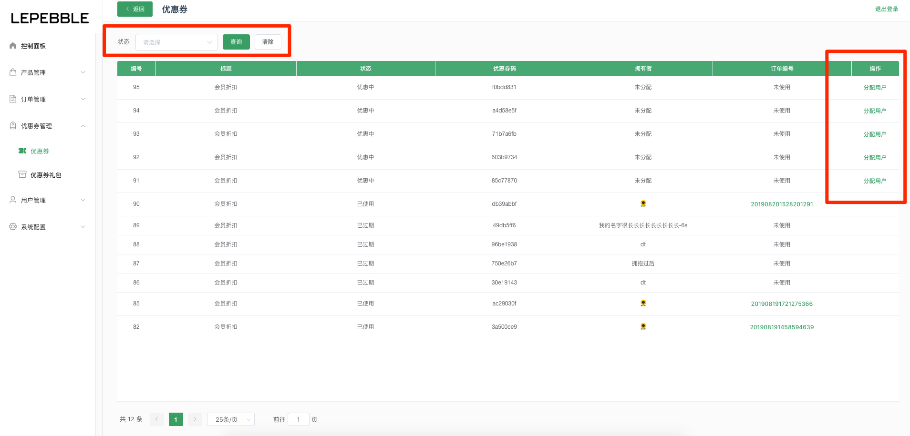

# 6.1 优惠券

## 优惠券列表

在优惠券列表页面可以查看当前系统下所有的优惠券

* 搜索：通过列表顶部的搜索栏搜索优惠券的标题、类型（折扣/满减）搜索优惠券
* 新建优惠券模版：通过 **新建优惠券模版** 创建新的优惠券
* 操作：通过列表右边的操作按钮，可以查看优惠券详情、生成优惠券、查看优惠券列表、停用优惠券

## 新建优惠券模版

字段说明：

* 标题（必填）：优惠券的标题
* 说明（必填）：优惠券的说明
* 是否启用优惠券：勾选后，创建成功立即启用
* 票券图片（必传）：图片建议尺寸 334:72
* 详情图片（必传）：图片建议尺寸 334:72
* 失效图片（必传）：图片建议尺寸 334:72
* 类型（必选）：折扣或者满减
* 用户类型（必选）：所有会员或会员，设置使用优惠券的门槛
* 是否有使用门槛：开启后，输入使用优惠券的门槛金额
* 用券时间（必选）：选择一个用券的期限
* 产品：优惠券可以关联产品使用
* 管理员备注：备注信息

## 优惠券详情

通过列表右边的操作按钮，查看优惠券的详情。

## 生成后的优惠券列表

通过列表右边的操作按钮，点击**优惠券列表**查看已经生成分配的优惠券情况。

* 分配用户：可以把生成后的优惠券分配给指定的用户
* 搜索：根据优惠券的使用状态搜索优惠券

