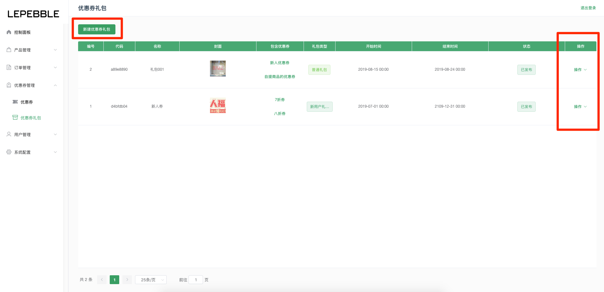
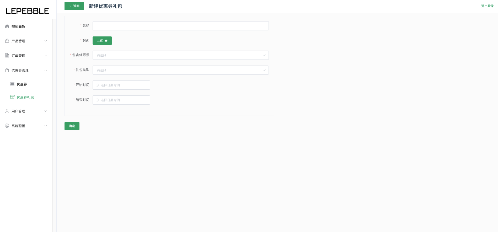
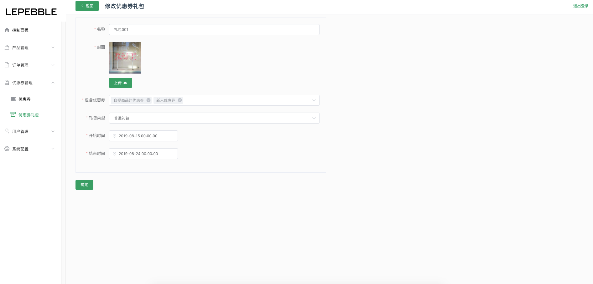
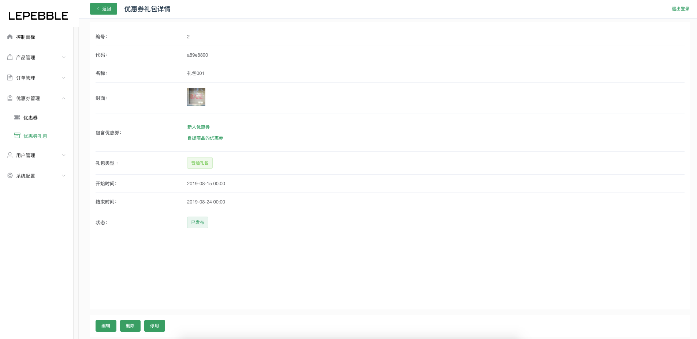

# 6.2 优惠券礼包

### 优惠券礼包列表

在优惠券礼包管理，可以把已经创建好的优惠卷打包发布。

* 新建优惠券礼包：创建新的优惠券礼包
* 操作：在列表的右边可以操作，查看优惠券礼包详情、编辑、删除、停用。

### 新建优惠券礼包

新建优惠券礼包页面

字段说明：

* 名称（必填）：优惠券礼包的名称
* 封面（必传）：优惠券礼包的封面图片
* 包含优惠券（必选）：选择优惠券礼包里面所包含的优惠券
* 礼包类型（必选）：普通礼包、会员礼包、新用户礼包
* 开始时间（必填）：优惠券礼包的生效时间
* 结束时间（必填）：优惠券礼包的结束时间

### 编辑优惠券礼包

### 优惠券礼包详情

